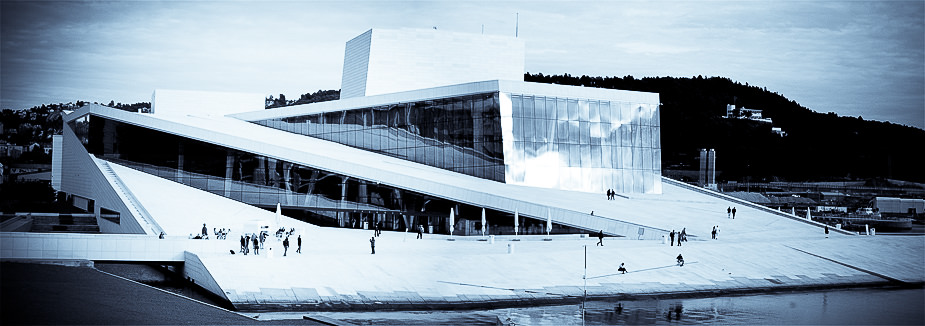
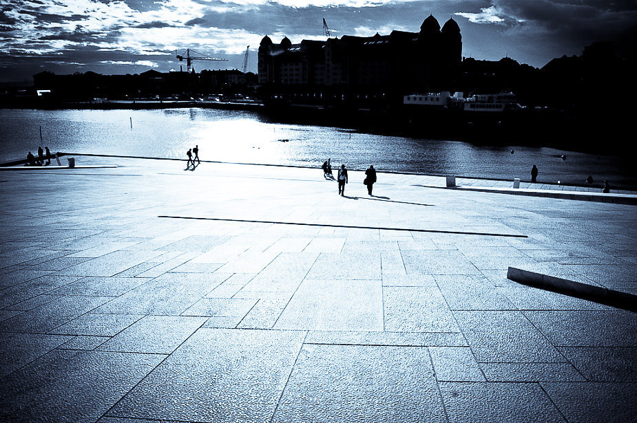
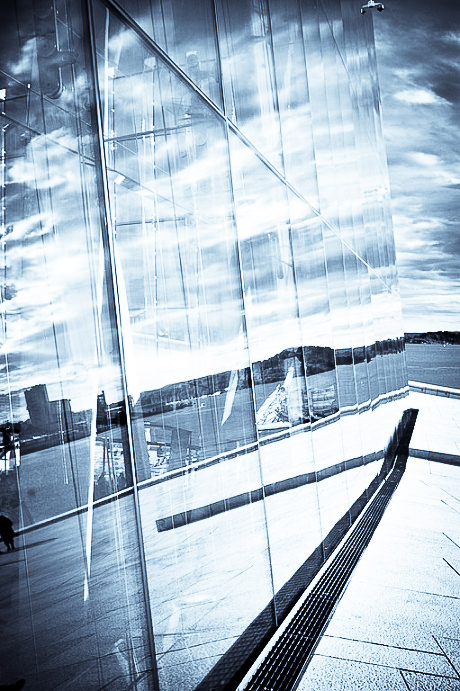
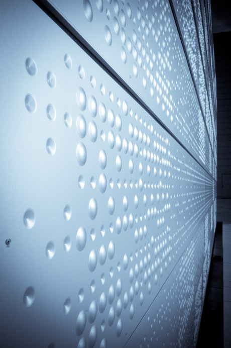
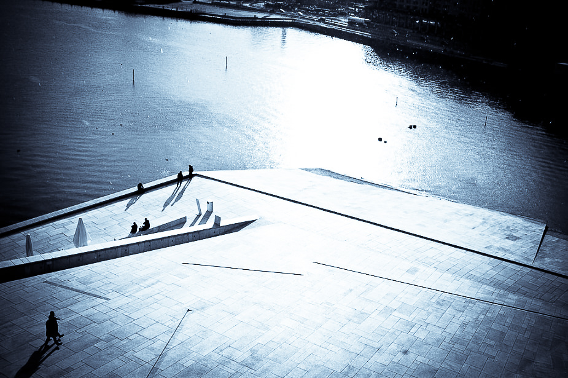
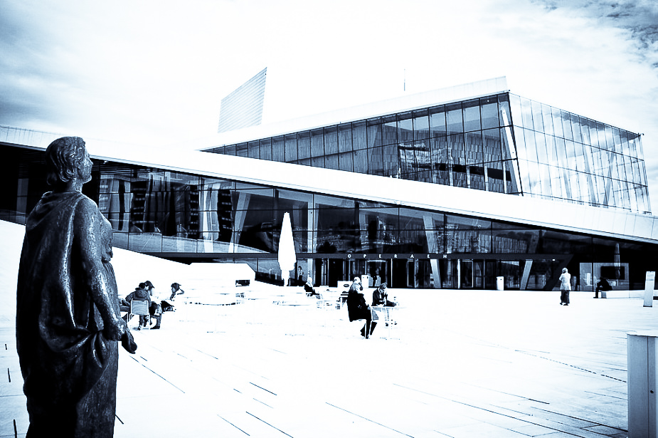
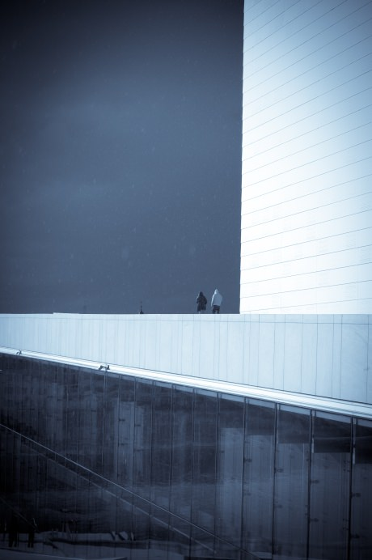
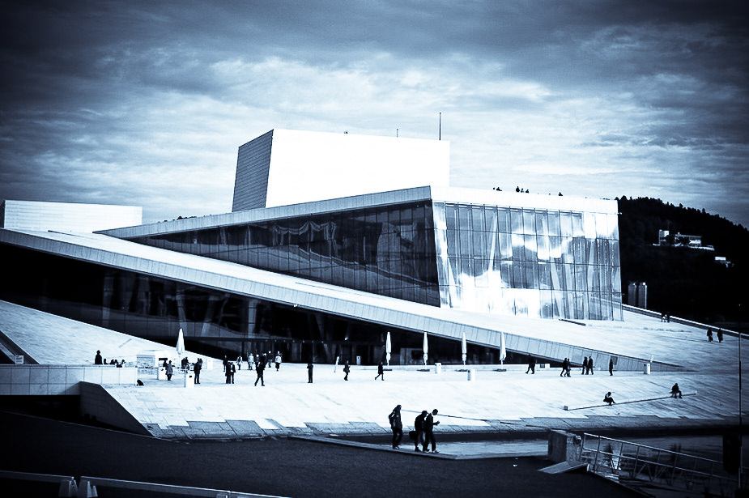
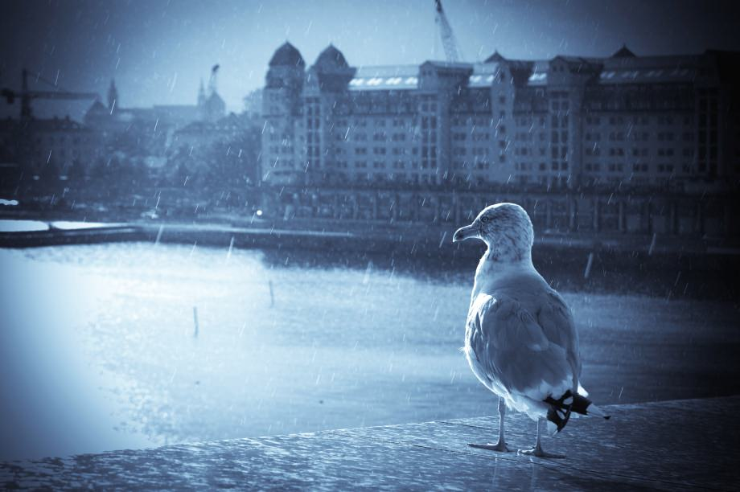

"She's Norwegian, gorgeous, full of fun, yet with surprising hidden depths. Quite literally so, since her lower limbs are permanently submerged in the sea. No, she's not a mermaid. She's the new Oslo Opera House, an amazing marble and granite vision that rises out of the fjord like a giant ice floe." Richard Morrison (Sunday Times)

===

Last week I travelled to Oslo, to see the sites and take a look at the new opera house.  I was impressed.   It's a fabulous space, located at the edge of the fjord and the design is both beautiful and empowering as you walk to the roof of the structure.

{.img-half-right}{.img-half-left}

{.img-half-right}{.img-half-left}

{.img-half-right}{.img-half-left}

